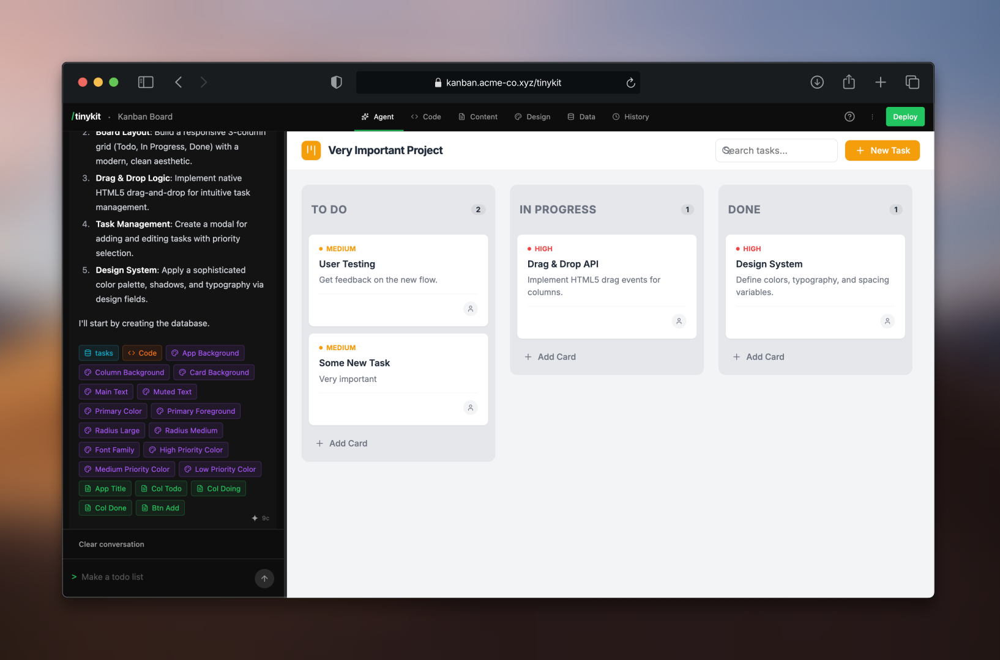

<br />
<p align="center">
    <picture>
      <source media="(prefers-color-scheme: dark)" srcset="static/logo-dark.svg">
      <source media="(prefers-color-scheme: light)" srcset="static/logo-light.svg">
      
    </picture>
</p>
<p align="center">
    <b>The open-source agentic app builder.</b> <br />
    Think Lovable, Replit, or v0, but self-hostable and self-contained.<br>
    Build at <code>/darkpearl</code>, deploy to <code>/</code>
</p>

<div align="center">



</div>

## Overview

DarkPearl is an open-source platform for building and deploying web apps with AI. It manages code, database, content, and deployment under the hood, letting you focus on the details.

### Features

- **Agentic Builder**: Prompt the AI to write code, create fields and tables, and wire it all up.
- **Self-Hosted**: Your server, your data. Powered by PocketBase. Docker optional.
- **Realtime Database**: Auto-generated tables that sync in real-time.
- **Code Editor**: Direct access to your source. One Svelte file per app.
- **Content Fields**: Edit text without touching code—like a mini CMS.
- **Design System**: Update colors, fonts, shadows from a visual editor.
- **Time Travel**: Snapshots on every change. Undo anything.
- **Image Uploads**: Built-in asset storage for images and files.
- **Bring Your Own LLM**: OpenAI, Anthropic, or Gemini (more coming soon).
- **Backend Functionality (soon)** — Background jobs, CRON, server-side routes
- **Authentication (soon)** — Email and OAuth signup in your apps
- **Showcase (soon)** — Browse and one-click install community apps
- **LLM Functionality (soon)** — AI-powered features and agentic workflows in your apps

**Run hundreds of apps on one server.** Point any domain → get a working app.

> DarkPearl is in early alpha and evolving every day. Your suggestions, ideas, and reported bugs help us immensely. Raise a GitHub issue to report bugs or suggest features.

### Star the project to give the maintainers a dopamine hit ⭐

## Getting Started

The easiest way to get started is with Railway. Otherwise, you can run it locally with Docker or Node.js.

## Quick Deploy

Deploy with Docker or on your own VPS. See the deployment guides in the `deploy/` directory for detailed instructions.

## Running Locally

### Docker

The simplest way to run DarkPearl locally:

```bash
git clone https://github.com/darkpearl-studio/darkpearl.git
cd darkpearl/deploy/docker
docker-compose up -d
```

This starts DarkPearl on port 5173. Visit http://localhost:5173/setup to complete first-time setup.

See [deploy/docker/README.md](./deploy/docker/README.md) for more options.

### Node.js

If you prefer running directly with Node:

```bash
# Clone and install
git clone https://github.com/darkpearl-studio/darkpearl.git
cd darkpearl
npm install

# Start dev server (auto-downloads PocketBase)
npm run dev
```

Visit http://localhost:5173/setup to complete setup.

## Usage

### Domain-Based Routing

Each app gets its own domain. Point multiple domains to one DarkPearl server:

```
calculator.myserver.com/                  → Serves calculator app
calculator.myserver.com/darkpearl/studio  → Edit calculator app

blog.myserver.com/                        → Serves blog app
blog.myserver.com/darkpearl/studio        → Edit blog app
```

### Access Points

| URL                    | Description               |
| ---------------------- | ------------------------- |
| `/`                    | Your production app       |
| `/darkpearl/studio`    | Edit current domain's app |
| `/darkpearl/dashboard` | See all apps              |
| `/darkpearl/settings`  | LLM configuration         |

### Templates

12+ starter templates to kickstart your apps:

| Category         | Templates                          |
| ---------------- | ---------------------------------- |
| **Productivity** | Kanban, Notes, Canvas, Timer       |
| **Finance**      | Expense tracker, Invoice generator |
| **Content**      | Bookmarks, Recipes                 |
| **Social**       | Linktree, Poll, Event RSVP         |
| **News**         | HN reader, RSS reader              |

## Get Involved

- Found a bug? Open an issue on [GitHub](https://github.com/darkpearl-studio/darkpearl/issues)

## License

[MIT](./LICENSE)

--

<p><i>Build your digital homestead.</i></p>
