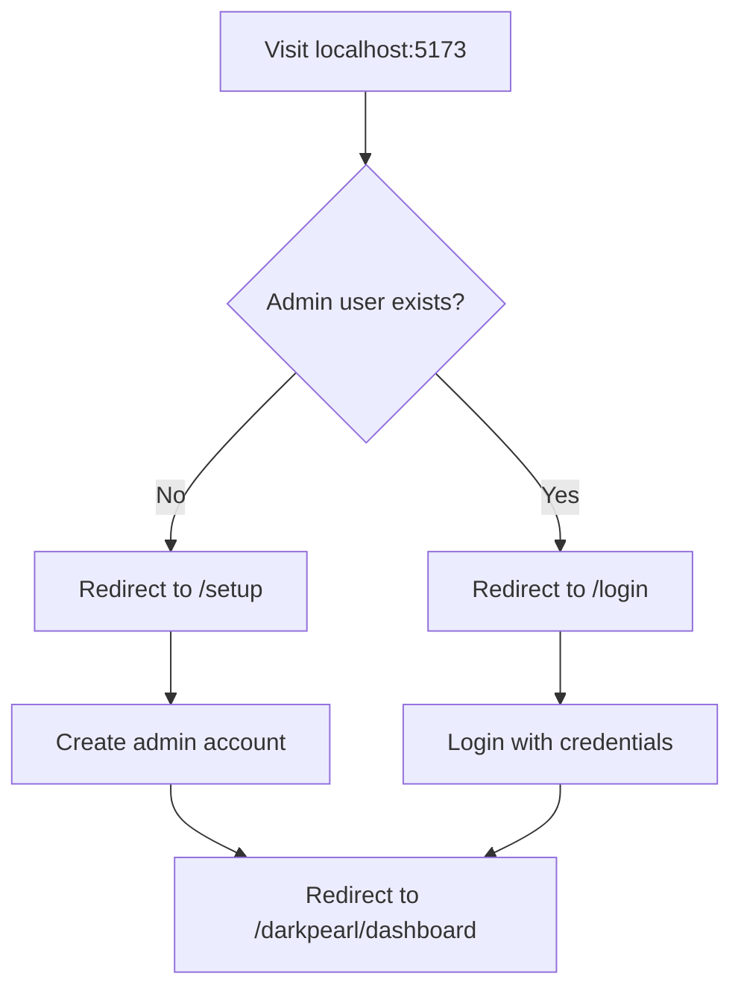
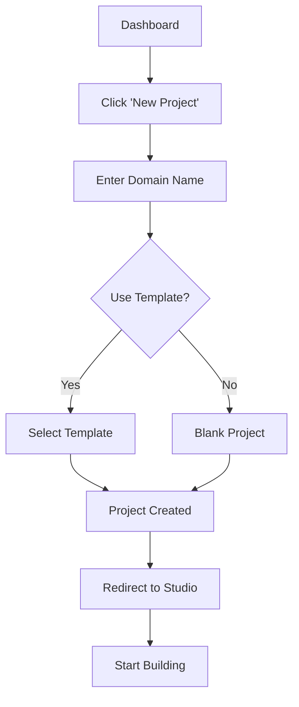
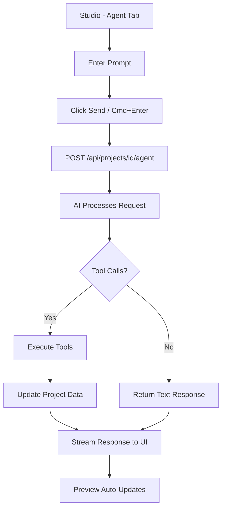
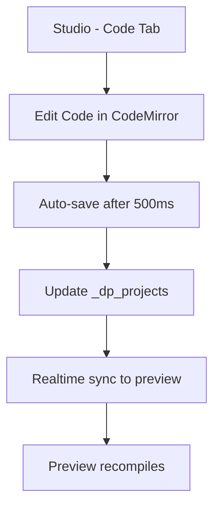
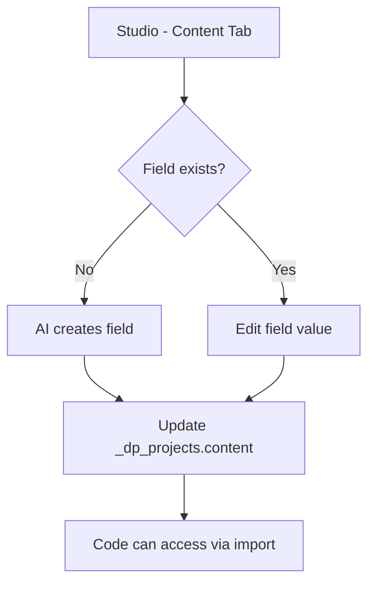
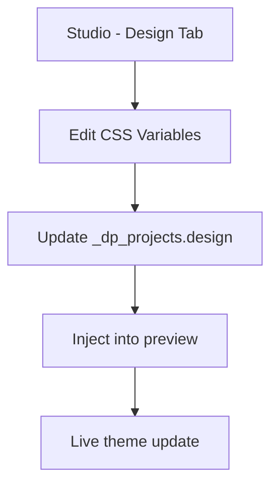
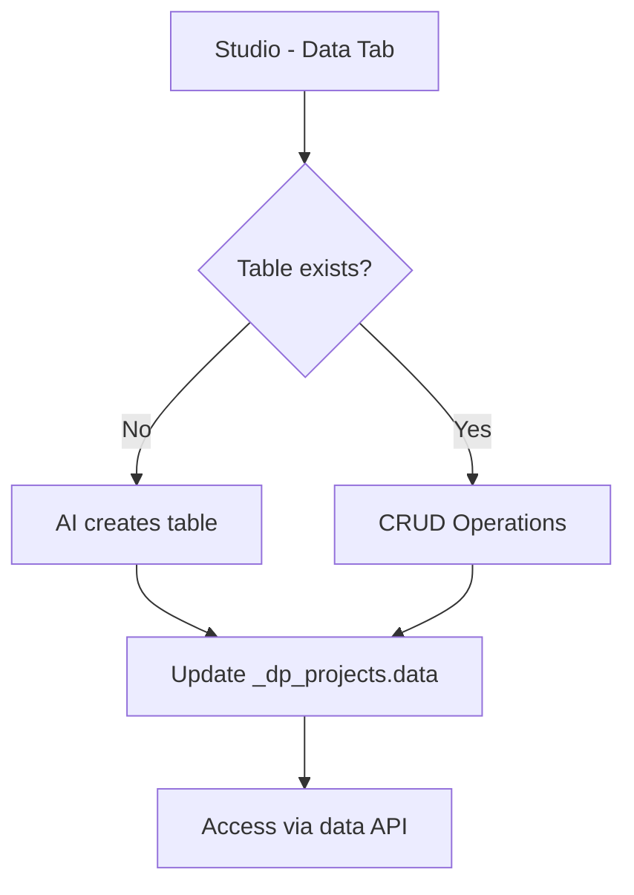
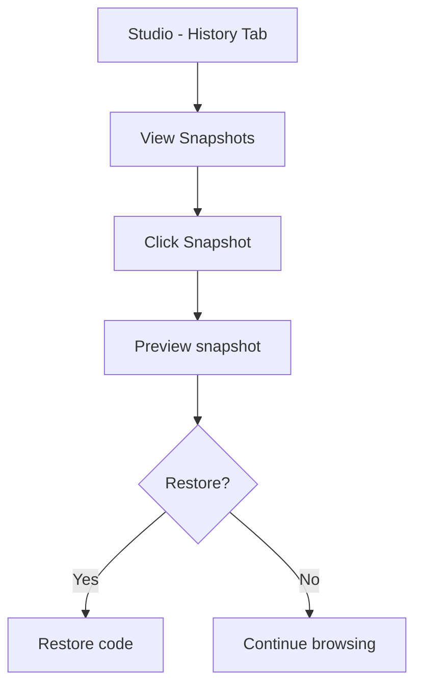
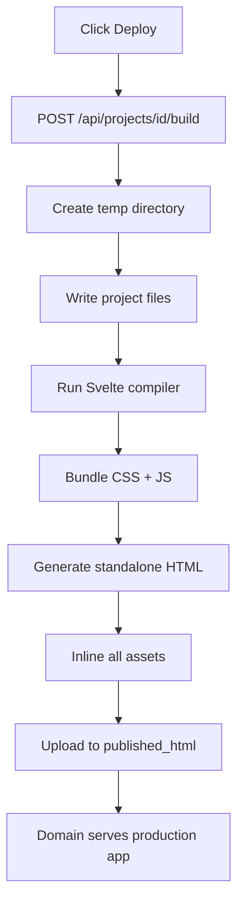

# DarkPearl - Application Workflow Guide

## Table of Contents
1. [Overview](#overview)
2. [Initial Setup Workflow](#initial-setup-workflow)
3. [User Workflows](#user-workflows)
4. [Architecture & Data Flow](#architecture--data-flow)
5. [Development Workflow](#development-workflow)
6. [AI Agent Workflow](#ai-agent-workflow)
7. [Build & Deployment Workflow](#build--deployment-workflow)

---

## Overview

**DarkPearl** is a self-hosted AI development platform that helps you build production-ready CRUD applications using AI assistance. It combines a code editor, AI agent, database, and hosting in one integrated platform.

### Core Components
- **Frontend**: SvelteKit 2.x + TypeScript
- **Database**: Pocketbase (local SQLite)
- **AI**: Vercel AI SDK (supports OpenAI, Anthropic, Google, DeepSeek)
- **Editor**: CodeMirror 6 with Svelte syntax support
- **Compiler**: In-browser Svelte compiler for live preview

---

## Initial Setup Workflow

### 1. Installation & First Run

```bash
# Clone or extract the repository
cd darkpearl

# Install dependencies
npm install

# Start the application
npm run dev
```

**What happens:**
1. `npm install` downloads all dependencies
2. `npm run dev` starts:
   - Pocketbase server on port 8091
   - Vite dev server on port 5173
   - Pocketbase is proxied through Vite at `/_pb/`

### 2. First-Time Setup Flow



**Steps:**
1. Open browser: `http://localhost:5173`
2. Redirected to: `http://localhost:5173/setup`
3. Create your admin account:
   - Email (must be valid format)
   - Password (min 8 characters)
   - Confirm password
4. Click "Create Account"
5. Automatically logged in → Redirected to Dashboard

### 3. LLM Configuration

```
Dashboard → Settings → Configure LLM
```

**Flow:**
1. Visit `/darkpearl/settings`
2. Select AI Provider:
   - **OpenAI** (GPT-4, GPT-4o-mini)
   - **Anthropic** (Claude Sonnet, Claude Haiku)
   - **Google** (Gemini 2.5 Pro, Flash)
   - **DeepSeek** (DeepSeek Chat, Reasoner)
3. Enter API Key
4. Select Model
5. Click "Test Connection"
6. Save settings

**Storage:**
- Settings saved to `_dp_settings` collection
- ID: `"llm"`
- Value: `{ provider, apiKey, model, baseUrl? }`

---

## User Workflows

### Workflow 1: Creating a New Project



**Detailed Steps:**

1. **Navigate to Dashboard**
   - URL: `/darkpearl/dashboard`
   - Shows all your projects

2. **Create New Project**
   - Click "New Project" button
   - Modal opens with form:
     - **Domain**: Unique identifier (e.g., `blog`, `shop`)
     - **Template**: Optional starter template
   - Click "Create"

3. **What Happens Behind the Scenes:**
   ```
   POST /api/projects
   ↓
   Create record in _dp_projects
   {
     domain: "blog",
     frontend_code: "<template code>",
     design: [...],
     content: [...],
     agent_chat: [],
     settings: { vibe_zone_enabled: true }
   }
   ↓
   Redirect to /darkpearl/studio?id={project_id}
   ```

### Workflow 2: Building with AI Agent



**Detailed Steps:**

1. **Open Agent Panel** (Cmd+1)
   - Left sidebar → Agent tab
   - Chat interface with conversation history

2. **Send a Prompt**
   - Example: *"Create a todo list app with add, complete, and delete features"*
   - Click Send or press `Cmd+Enter` (Mac) / `Ctrl+Enter` (Windows)

3. **AI Agent Processing:**
   ```
   User Prompt
   ↓
   POST /api/projects/{id}/agent
   ↓
   Server: Fetch LLM config from _dp_settings
   ↓
   Build system prompt with project context:
   - Current code
   - Design fields
   - Content fields
   - Data tables
   ↓
   Stream to AI Provider (OpenAI/Anthropic/etc)
   ↓
   AI Returns: Text + Tool Calls
   ```

4. **Available AI Tools:**

   | Tool | Purpose | Example |
   |------|---------|---------|
   | `write_code` | Write/update frontend code | Updates Svelte components |
   | `create_content_field` | Add CMS fields | Title, description, etc. |
   | `update_content_field` | Update content values | Set page title |
   | `create_design_field` | Add CSS variables | Primary color, font |
   | `update_design_field` | Update design values | Change color to blue |
   | `create_data_table` | Create data structure | Users table |
   | `add_data_record` | Insert data | Add new user |
   | `update_data_record` | Modify data | Update user email |
   | `delete_data_record` | Remove data | Delete user |

5. **Tool Execution Flow:**
   ```
   AI calls: write_code({ code: "..." })
   ↓
   Server executes tool
   ↓
   Update _dp_projects.frontend_code
   ↓
   Pocketbase realtime subscription fires
   ↓
   Studio UI updates automatically
   ↓
   Preview iframe recompiles and updates
   ```

6. **Live Preview Updates:**
   - Code changes trigger automatic recompilation
   - Preview iframe shows changes in ~100-500ms
   - No manual refresh needed

### Workflow 3: Manual Code Editing



**Steps:**

1. **Open Code Panel** (Cmd+2)
   - Full-featured code editor
   - Syntax highlighting for Svelte
   - Emmet support
   - Auto-completion

2. **Edit Code**
   - Make changes directly
   - Auto-saves after 500ms of inactivity
   - ID: `darkpearl-builder-code`

3. **See Changes Live**
   - Preview updates automatically
   - Compilation errors shown in preview

### Workflow 4: Managing Content (CMS)



**Content System:**

1. **Create Content Fields** (via AI):
   - Prompt: *"Add a site title and tagline"*
   - AI calls: `create_content_field({ id: "site_title", label: "Site Title", type: "text" })`

2. **Edit Content** (Content Tab - Cmd+3):
   - Visual form interface
   - Edit values without touching code
   - Changes saved to `_dp_projects.content`

3. **Access in Code:**
   ```svelte
   <script>
   import { content } from '$darkpearl/lib/api.svelte'

   const siteTitle = $derived(content.site_title)
   </script>

   <h1>{siteTitle}</h1>
   ```

### Workflow 5: Theming (Design System)



**Design Workflow:**

1. **Design Panel** (Cmd+4)
   - Visual controls for CSS variables
   - Color pickers
   - Font selectors
   - Spacing controls

2. **Design Fields:**
   ```json
   {
     "id": "primary-color",
     "label": "Primary Color",
     "type": "color",
     "value": "#3b82f6"
   }
   ```

3. **Applied to Code:**
   ```css
   :root {
     --primary-color: #3b82f6;
   }
   ```

### Workflow 6: Data Management



**Data System:**

1. **Create Table** (via AI):
   - Prompt: *"Create a users table with name and email fields"*
   - AI calls: `create_data_table({ name: "users", fields: [...] })`

2. **Manage Data** (Data Tab - Cmd+5):
   - View all tables
   - Add/Edit/Delete records
   - Visual table interface

3. **Storage:**
   ```json
   _dp_projects.data = {
     "users": {
       "fields": [
         { "name": "name", "type": "text" },
         { "name": "email", "type": "email" }
       ],
       "records": [
         { "id": "1", "name": "John", "email": "john@example.com" }
       ]
     }
   }
   ```

4. **Access in Code:**
   ```svelte
   <script>
   import { data_files, load_data_file } from '$darkpearl/lib/api.svelte'

   const users = $derived(load_data_file('users'))
   </script>

   {#each users as user}
     <div>{user.name} - {user.email}</div>
   {/each}
   ```

### Workflow 7: Time Travel (History)



**History System:**

1. **Snapshots Created:**
   - After each AI interaction
   - Stored in `_dp_projects.snapshots`
   - Code-only (no content/design)

2. **Restore Workflow:**
   - History Tab (Cmd+6)
   - Click snapshot to preview
   - Click "Restore" to revert

---

## Architecture & Data Flow

### System Architecture

```
┌─────────────────────────────────────────────────────────┐
│                    User Browser                          │
├─────────────────────────────────────────────────────────┤
│  Studio UI (SvelteKit)                                   │
│  ├─ Agent Panel ─────> Chat with AI                      │
│  ├─ Code Panel ──────> CodeMirror Editor                 │
│  ├─ Content Panel ───> CMS Interface                     │
│  ├─ Design Panel ────> Theme Editor                      │
│  ├─ Data Panel ──────> Table Manager                     │
│  └─ Preview ─────────> Iframe (compiled Svelte)         │
└──────────────┬──────────────────────────────────────────┘
               │
               │ HTTP + WebSocket
               ▼
┌─────────────────────────────────────────────────────────┐
│              SvelteKit Server (Port 5173)                │
├─────────────────────────────────────────────────────────┤
│  API Routes:                                             │
│  ├─ /api/projects/{id}/agent ──> AI streaming           │
│  ├─ /api/projects/{id}/build ──> Server build           │
│  ├─ /api/settings ────────────> LLM config              │
│  └─ /_dp/* ───────────────────> Data endpoints          │
└──────────────┬──────────────────────────────────────────┘
               │
               │ Proxy /_pb/*
               ▼
┌─────────────────────────────────────────────────────────┐
│            Pocketbase Server (Port 8091)                 │
├─────────────────────────────────────────────────────────┤
│  Collections:                                            │
│  ├─ _dp_projects ─> All project data                    │
│  ├─ _dp_settings ─> LLM configuration                   │
│  ├─ _dp_kits ─────> Project templates                   │
│  └─ users ────────> Admin accounts                      │
│                                                          │
│  Storage: pb_data/data.db (SQLite)                      │
└─────────────────────────────────────────────────────────┘
               │
               │ External API Call
               ▼
┌─────────────────────────────────────────────────────────┐
│              AI Provider (OpenAI/Anthropic/etc)          │
└─────────────────────────────────────────────────────────┘
```

### Request Flow Examples

#### 1. AI Chat Request

```
User types prompt
↓
POST /api/projects/{id}/agent
  Body: { messages: [...], project_id }
↓
Server:
  1. Fetch project from Pocketbase (_dp_projects)
  2. Fetch LLM config from Pocketbase (_dp_settings)
  3. Build system prompt with project context
  4. Call AI provider (streaming)
↓
AI responds with:
  - Text chunks (streamed to client)
  - Tool calls (executed server-side)
↓
Tool execution:
  - write_code() → Update _dp_projects.frontend_code
  - create_content_field() → Update _dp_projects.content
  - etc.
↓
Pocketbase realtime subscription fires
↓
Client receives update via WebSocket
↓
UI updates automatically
↓
Preview recompiles
```

#### 2. Live Preview Compilation

```
User edits code / AI updates code
↓
Code saved to _dp_projects.frontend_code
↓
Preview iframe receives message
↓
In-browser compiler:
  1. Parse Svelte code
  2. Compile to JavaScript
  3. Inject into iframe DOM
↓
Preview updates in ~100-500ms
```

#### 3. Production Build

```
User clicks "Deploy"
↓
POST /api/projects/{id}/build
↓
Server:
  1. Fetch project code
  2. Create temporary build directory
  3. Run Svelte compiler (server-side)
  4. Bundle into single HTML file
  5. Inline all CSS/JS
  6. Generate standalone HTML
↓
Upload to _dp_projects.published_html (file field)
↓
Production app served at domain root (/)
```

#### 4. Domain-Based Routing

```
Request to: blog.myserver.com/
↓
SvelteKit hooks.server.ts
↓
Extract domain: "blog"
↓
Query _dp_projects WHERE domain = "blog"
↓
Found?
  ├─ Yes → Serve published_html
  └─ No → 404

Request to: blog.myserver.com/darkpearl/studio
↓
Serve Studio editor for "blog" project
```

---

## Development Workflow

### Local Development

```bash
# Start dev server
npm run dev
# Pocketbase: http://127.0.0.1:8091
# Frontend: http://localhost:5173

# Type checking
npm run check

# Build for production
npm run build

# Preview production build
npm run preview
```

### Code Structure

```
src/
├── routes/
│   ├── darkpearl/              # Admin interface
│   │   ├── studio/             # Main editor
│   │   │   ├── +page.svelte    # Studio layout
│   │   │   ├── project.svelte.ts   # Project store
│   │   │   ├── panels/         # Tab panels
│   │   │   └── components/     # UI components
│   │   ├── dashboard/          # Projects list
│   │   ├── settings/           # LLM config
│   │   └── new/                # New project
│   ├── _dp/                    # Internal API routes
│   ├── api/                    # External API routes
│   ├── login/                  # Login page
│   ├── setup/                  # First-time setup
│   └── +server.ts              # Root route (production apps)
│
├── lib/
│   ├── ai/                     # AI agent system
│   ├── compiler/               # In-browser Svelte compiler
│   ├── components/             # Shared UI components
│   ├── server/                 # Server utilities
│   ├── services/               # Data services
│   ├── stores/                 # Reactive stores
│   └── pocketbase.svelte.ts    # PB client + auth
│
└── hooks.server.ts             # Domain routing + PB proxy
```

### Key Files

| File | Purpose |
|------|---------|
| `project.svelte.ts` | Reactive project state management |
| `sdk-agent.ts` | AI agent with tool calling |
| `pocketbase.svelte.ts` | Auth + PB client singleton |
| `hooks.server.ts` | Domain resolution + PB proxy |
| `compiler/iframe.js` | In-browser Svelte compilation |
| `builder_themes.ts` | Studio UI themes |

---

## AI Agent Workflow

### Agent System Prompt

```javascript
const systemPrompt = `
You are an AI assistant helping build a Svelte 5 application.

Current Project:
- Code: ${project.frontend_code}
- Design: ${JSON.stringify(project.design)}
- Content: ${JSON.stringify(project.content)}
- Data: ${JSON.stringify(project.data)}

Available Tools:
- write_code: Update frontend code
- create_content_field: Add CMS field
- update_content_field: Update content value
- create_design_field: Add CSS variable
- update_design_field: Update design value
- create_data_table: Create data table
- add_data_record: Insert record
- update_data_record: Update record
- delete_data_record: Delete record

Instructions:
- Use Svelte 5 runes syntax ($state, $derived, $props)
- Write clean, modern code
- Use Tailwind CSS for styling
- Follow best practices
`
```

### Tool Execution Flow

```javascript
// 1. AI decides to call tool
{
  type: "tool-call",
  toolName: "write_code",
  args: {
    code: "<script>let count = $state(0)</script>..."
  }
}

// 2. Server executes tool
async function write_code({ code }) {
  await pb.collection('_dp_projects').update(project.id, {
    frontend_code: code
  })

  // Create snapshot
  const snapshots = project.snapshots || []
  snapshots.push({
    timestamp: Date.now(),
    code: project.frontend_code // old code
  })
  await pb.collection('_dp_projects').update(project.id, {
    snapshots
  })
}

// 3. Return result to AI
{
  type: "tool-result",
  result: "Code updated successfully"
}

// 4. AI continues or finishes
```

---

## Build & Deployment Workflow

### Development vs Production

| Environment | Compilation | Server | Purpose |
|-------------|-------------|--------|---------|
| **Development** | In-browser | Vite | Fast iteration, hot reload |
| **Production** | Server-side | SvelteKit | Optimized, standalone HTML |

### Production Build Flow



**Detailed Steps:**

1. **Trigger Build:**
   ```javascript
   // Studio UI
   async function deploy() {
     const response = await fetch(`/api/projects/${id}/build`, {
       method: 'POST'
     })
     const html = await response.text()
     // html is uploaded to published_html field
   }
   ```

2. **Server-Side Build:**
   ```javascript
   // /api/projects/[id]/build/+server.ts

   // 1. Fetch project
   const project = await pb.collection('_dp_projects').getOne(id)

   // 2. Create temp build environment
   const tempDir = `/tmp/darkpearl-build-${id}`

   // 3. Write files
   fs.writeFileSync(`${tempDir}/App.svelte`, project.frontend_code)

   // 4. Compile with Svelte
   const compiled = svelte.compile(project.frontend_code, {
     generate: 'dom',
     hydratable: false
   })

   // 5. Bundle and minify
   const bundled = await rollup({
     input: compiled.js.code,
     plugins: [terser()]
   })

   // 6. Generate HTML with inlined assets
   const html = `
   <!DOCTYPE html>
   <html>
     <head>
       <style>${inlinedCSS}</style>
     </head>
     <body>
       <div id="app"></div>
       <script>${inlinedJS}</script>
     </body>
   </html>
   `

   // 7. Upload to Pocketbase
   const formData = new FormData()
   formData.append('published_html', new Blob([html]), 'index.html')
   await pb.collection('_dp_projects').update(id, formData)
   ```

3. **Serve Production App:**
   ```javascript
   // src/routes/+server.ts

   export async function GET({ url }) {
     const domain = url.hostname.split('.')[0]

     const projects = await pb.collection('_dp_projects')
       .getList(1, 1, { filter: `domain = "${domain}"` })

     if (projects.items.length === 0) {
       return new Response('Not Found', { status: 404 })
     }

     const project = projects.items[0]
     const htmlUrl = pb.files.getUrl(project, project.published_html)

     // Fetch and serve HTML
     const html = await fetch(htmlUrl).then(r => r.text())
     return new Response(html, {
       headers: { 'Content-Type': 'text/html' }
     })
   }
   ```

### Multi-Domain Hosting

```
┌─────────────────────────────────────────────────────────┐
│                  DarkPearl Server                        │
│                  (darkpearl.com)                         │
└─────────────────────────────────────────────────────────┘
                          │
         ┌────────────────┼────────────────┐
         │                │                │
         ▼                ▼                ▼
┌────────────────┐ ┌────────────────┐ ┌────────────────┐
│  blog.com      │ │  shop.com      │ │  docs.com      │
├────────────────┤ ├────────────────┤ ├────────────────┤
│ /              │ │ /              │ │ /              │
│ └─> Blog App   │ │ └─> Shop App   │ │ └─> Docs App   │
│                │ │                │ │                │
│ /darkpearl/*   │ │ /darkpearl/*   │ │ /darkpearl/*   │
│ └─> Editor     │ │ └─> Editor     │ │ └─> Editor     │
└────────────────┘ └────────────────┘ └────────────────┘
```

**Setup:**
1. Point all domains to your DarkPearl server IP
2. Each domain gets its own project in `_dp_projects`
3. Domain field in database matches hostname
4. Root path (/) serves production app
5. /darkpearl/* paths serve editor for that domain

---

## Summary

### Key Workflows

1. **Setup**: Install → Create admin → Configure LLM
2. **Create Project**: Dashboard → New → Choose template
3. **Build with AI**: Agent tab → Describe what you want → AI builds it
4. **Manual Edit**: Code tab → Edit directly → Auto-save
5. **Manage Content**: Content tab → Edit CMS fields
6. **Theme**: Design tab → Adjust colors/fonts
7. **Data**: Data tab → Manage tables and records
8. **Deploy**: Build → Upload HTML → Serve at domain root

### Data Storage

| Data Type | Collection | Field | Format |
|-----------|------------|-------|--------|
| Code | `_dp_projects` | `frontend_code` | Text (10MB max) |
| Content | `_dp_projects` | `content` | JSON array |
| Design | `_dp_projects` | `design` | JSON array |
| Data | `_dp_projects` | `data` | JSON object |
| Chat | `_dp_projects` | `agent_chat` | JSON array |
| History | `_dp_projects` | `snapshots` | JSON array |
| Production | `_dp_projects` | `published_html` | File |
| LLM Config | `_dp_settings` | `value` | JSON object |

### Performance Characteristics

- **Preview compilation**: 100-500ms
- **AI response time**: 2-10s (depends on provider)
- **Auto-save debounce**: 500ms
- **Realtime sync**: <100ms (Pocketbase WebSocket)
- **Production build**: 5-15s

---

**Made with DarkPearl** 🌑💎
